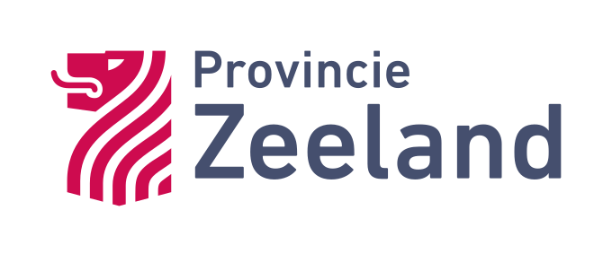

# Leia Open Source 3D Viewer
Generic 3D viewer for Digital Twin purposes. 

_An initiative by Geodan and Provincie Zeeland._

<p float="left">
  	<a href="https://www.geodan.com/">
  		
	</a>
  	<a href="https://www.zeeland.nl/">
  		
	</a>
</p>

# For Developers

## Configure environment variables

Create a copy of `.env.example` and name it `.env`. Fill in the required environment variables.

## Run in development mode

```sh
npm install
npm run dev
```

## Build

### With Docker

```sh
docker build -t 3d-viewer .
docker run -p 3000:3000 3d-viewer
```

### With Node

```sh
npm run build
```

### Static build

The default build will create a build which can be served with node and cannot be served statically because the build proccess automatically picks up server side scripts such as ./routes/+layour.server.ts. 

Before building, it is important to configure the environment variable `APP_URL` in `.env`. Make sure this variable points to the base path of your application, for example `https://site.com/some/path/`.

Run the static build with:

```sh
npm run build --adapter=static
```

Output of the static build can be found in the ./build directory.

### Changes made to make static build work

`svelt.config.js` is configured to be able to run the 'normal' and static build, the static build will use a different routes folder `routes-static` which contains an altered version of +layout.svelte and does not include `+layout.server.ts`.

## Configure the viewer

With the static build there are 2 ways to load a configuration.

1) Start the viewer with `?url=http://host.com/some_config.json`, the viewer will try to load the configuration from url
2) Place a file named config.json in the root directory of the build. When ?url is supplied the local file will not be used.

An example config is stored in `./static/example.config.json`.

### Viewer configuration ("viewer: {}")

Base configuration for the viewer such as start position, UI colors.

|value|description|type|
|-|-|-|
|startPosition|Startposition of the camera|[startPosition](#startposition)|
|startCameraMode3D|Choose to start the camera in 2D or 3D mode|boolean|
|colors|Colors to use in de app, for more info check Carbon Design|[colors](#colors)|
|title|The title shown in the top bar of the viewer|string|
|subTitle|Subtitle shown in the top bar after the title|string|
|logo|Url for the image to show in the top left corner of the header|string|
|logoMarginLeft|Margin string for left margin of header logo|string|
|logoMarginRight|Margin string for right margin of header logo|string|

```json
"viewer": {
    "startPosition": ...,
    "colors": ...,
    "title": "Digital Twin",
    "subTitle": "Example",
    "logo": "http://host.nl/my_image.png"	
}
```

#### startPosition
The start position of the camera. Since we are using a 3D viewer we need more than just an x, y and z position. An easy way to interactively get all the parameters for your preferred startPosition is by using the dt-generic-viewer. Open the settings from the left menu bar and enable the option ```Camera position```. When moving the view you will see the camera settings appear in a box. You can copy these settings to the startPosition configuration. Note: pitch is always overwritten with -90 degrees if startCameraMode3D is set to false.

|value|description|type|
|-|-|-|
|x|Longitude position of the camera|number|
|y|Latitude position of the camera|number|
|z|Height of the camera in meters|number|
|heading|Heading of the camera (Rotation)|number|
|pitch|Pitch of the camera (up/down) where -90 is looking down, 0 is forward, 90 is up|number|
|duration|Time to fly to the location in seconds|number|

```json
"startPosition": {
    "x": 4.55009,
    "y": 51.93289,
    "z": 1108.00411,
    "heading": 344.23744,
    "pitch": -44.5522,
    "duration": 0
}
```

#### Colors
Colors for the GUI. The black header cannot be changed currently, this is an open issue for the Carbon Design svelte components devs.

|value|description|type|
|-|-|-|
|ui-background|Default page background|string|
|interactive-01|Primary interactive color. Primary buttons|string|
|interactive-02|Secondary interactive color. Secondary button|string|
|interactive-03|Tertiary button|string|
|interactive-04|Selected elements. Active elements. Accent icons|string|
|ui-01|Primary container background, Secondary page background|string|
|ui-02|Primary page background, Secondary container background|string|
|ui-03|Subtle border, Tertiary background color|string|
|ui-04|3:1 AA element contrast, Medium contrast border|string|
|ui-05|4.5:1 AA element contrast, High contrast border, Emphasis elements|string|
|text-01|Primary text, Body copy, Headers, Hover text color for text-02|string|
|text-02|Secondary text, Input labels, Help text|string|
|text-03|Placeholder text|string|
|text-04|Text on interactive colors|string|
|link-01|Primary links, Ghost button|string|
|icon-01|Primary icons|string|
|icon-02|Secondary icons|string|
|icon-03|Tertiary icons, Icons on interactive colors, Icons on non-ui colors|string|
|field-01|Default input fields, Field color on $ui-backgrounds|string|
|field-02|Input field color on $ui-02 backgrounds|string|
|inverse-01|Inverse text color, Inverse icon color|string|
|inverse-02|High contrast backgrounds, High contrast elements|string|
|support-01|Error|string|
|support-02|Success|string|
|support-03|Warning|string|
|support-04|Information|string|
|inverse-support-01|Danger in high contrast moments|string|
|inverse-support-02|Success in high contrast moments|string|
|inverse-support-03|Warning in high contrast moments|string|
|inverse-support-04|Information in high contrast moments|string|
|overlay-01|Background overlay|string|
|interaction-tokens|Focus border, Focus underline|string|
|hover-primary|interactive-01 hover|string|
|hover-primary-text|interactive-01 text hover|string|
|hover-secondary|interactive-02 hover|string|
|hover-tertiary|interactive-03 hover, $inverse-01 hover|string|
|hover-ui|ui-01 hover, $ui-02 hover, Transparent background hover|string|
|hover-selected-ui|Selected row hover|string|
|hover-danger|Danger hover, $support-01 hover|string|
|hover-row|Row hover|string|
|active-primary|interactive-01 active|string|
|active-secondary|$interactive-02 active, $inverse-01 active|string|
|active-tertiary|interactive-03 active|string|
|active-ui|$ui-01 active, $ui-02 active|string|
|active-danger|Danger active, $support-01 active|string|
|selected-ui|Selected UI elements|string|
|highlight|interactive-01 highlight|string|
|skeleton-01|Skeleton state of graphics|string|
|skeleton-02|Skeleton state of texts|string|
|visited-link|Visited links|string|
|disabled-01|Disabled fields, Disabled backgrounds, Disabled border|string|
|disabled-02|Disabled elements on $disabled-01, Disabled text on $disabled-01, Disabled icons, Disabled border|string|
|disabled-03|Disabled text on $disabled-02, Disabled icons on $disabled-02|string|

```json
"colors": {
    "ui-background": "#ffffff",
    "interactive-01": "#214170",
    "interactive-02": "#171717",
    "interactive-03": "#0062ff",
    "interactive-04": "#0062ff",
    "ui-01": "#f3f3f3",
    "ui-02": "#ffffff",
    "ui-03": "#dcdcdc",
    "ui-04": "#8c8c8c",
    "ui-05": "#171717",
    "text-01": "#171717",
    "text-02": "#565656",
    "text-03": "#8c8c8c",
    "text-04": "#ffffff",
    "link-01": "#0062ff",
    "icon-01": "#171717",
    "icon-02": "#565656",
    "icon-03": "#ffffff",
    "field-01": "#f3f3f3",
    "field-02": "#ffffff",
    "inverse-01": "#ffffff",
    "inverse-02": "#3d3d3d",
    "support-01": "#da1e28",
    "support-02": "#24a148",
    "support-03": "#fdd13a",
    "support-04": "#054ada",
    "inverse-support-01": "#fb4b53",
    "inverse-support-02": "#3dbb61",
    "inverse-support-03": "#fdd13a",
    "inverse-support-04": "#408bfc",
    "overlay-01": "#171717CC",
    "interaction-tokens": "#0062ff",
    "hover-primary": "#376dbc",
    "hover-primary-text": "#054ada",
    "hover-secondary": "#4c4c4c",
    "hover-tertiary": "#4cabd8",
    "hover-ui": "#e5e5e5",
    "hover-selected-ui": "#cacaca",
    "hover-danger": "#ba1b23",
    "hover-row": "#e5e5e5",
    "active-primary": "#376dbc",
    "active-secondary": "#6f6f6f",
    "active-tertiary": "#0530ad",
    "active-ui": "#bebebe",
    "active-danger": "#750e13",
    "selected-ui": "#dcdcdc",
    "highlight": "#C9deff",
    "skeleton-01": "#e5e5e5",
    "skeleton-02": "#bebebe",
    "visited-link": "#'Visited links'",
    "disabled-01": "#f3f3f3",
    "disabled-02": "#bebebe",
    "disabled-03": "#8c8c8c"
}
```

### Groups configuration ("groups: {}")

List of groups, these groups are used for grouping layers in the layer library, there is no limit on how many child groups there can be. The root parent should be on top.

|value|description|type|
|-|-|-|
|id|Unique identifier for the group|string|
|title|Display title in the UI|string|
|parentId|If this is a child group, set the parentId with the id of the parent group|string|

```json
"groups": [
    {
        "id": "1329651495370",
        "title": "My Layers",
        "parentId": ""
    },
    {
        "id": "1669651495322",
        "title": "My Layers Child Group",
        "parentId": "1329651495370"
    },
    {
        "id": "8658756230497",
        "title": "Nature",
        "parentId": ""
    }
]
```

### Layers configuration ("layers: {}")

An array of layer definitions.   

Layer definition
|value|description|type|
|-|-|-|
|id|unique layer id|string|
|type|layer type, supported layer types:<br /> ```basiskaart```, ```wms```, ```wmts```, ```tms```, ```vectortiles```, ```3dtiles```, ```geojson```, ```modelanimation```, ```custom```|string|
|title|layer title|string|
|groupId|id of the group where this layer belongs to or empty string, will be placed under uncategorized in library|string|
|imageUrl|url of an example image of layer, will be shown in layer library|string|
|legendUrl|url of legend image or empty string|string|
|isBackground|set to true to use this as a background layer, background layers are separated from the thematic layers in the layer manager and only 1 background layer can be active at a time|boolean|
|defaultAddToManager|true if layer should be inmediately available in the layer manager tool on startup|boolean|
|defaultOn|true if this layer should be visible at start up, use this together with defaultAddToManager|boolean|
|attribution|attribution for the layer data, to be displayed at at layer information page|string|
|metadata|an array of {"key":"somekey","value":"somevalue"} pairs, to store custom metadata which is shown in the layer library|array[KeyValue]|
|transparent|true if layer can be transparent|boolean|
|opacity|number between 0 (opaque) and 100 (transparent)|number|
|cameraPosition|Default camera position, when set a zoom to icon is displayed for the layer in the layer manager|cameraPosition, same as parameters for [startPosition](###startPosition)|
|settings|technical settings for the layer, this can differ between layer types, see LayerSettings below|LayerSettings|

#### LayerSettings for type wms

|value|description|default|type|
|-|-|-|-|
|url|base url for the layer service||string|
|featureName|name of feature or wms layer, can be found in WMS GetCapabilities||string|
|contenttype|the http content type for the map data to be retrieved|image/png|string|

```json
{
	"id": "1665483575374",
	"type": "wms",
	"title": "Beheer vlakken RWS (WMS)",
	"groupId": "1658756230497",
	"legendUrl": "https://geo.rijkswaterstaat.nl/services/ogc/gdr/beheerkaart_nat/ows?service=WMS&request=GetLegendGraphic&format=image%2Fpng&width=20&height=20&layer=beheer_vlakken",
	"isBackground": false,
	"defaultAddToManager": true,
	"defaultOn": false,
	"transparent": true,
	"opacity": 0,
    "cameraPosition": {
        "x": 4.55017,
        "y": 51.94717,
        "z": 10.1657,
        "heading": 336.80053,
        "pitch": -20.82619,
        "duration": 1.5
    },
	"settings": {
		"url": "https://geo.rijkswaterstaat.nl/services/ogc/gdr/beheerkaart_nat/ows?service=WMS&&version=1.3.0",
		"featureName": "beheer_vlakken",
		"contenttype": "image/png"
	}
}
```

#### LayerSettings for type wmts
LayerSettings
|value|description|type|
|-|-|-|
|url|base url for the layer service|string|
|featureName|name of feature or (wms-)/(wmst-)layer|string|
|contenttype|the http content type for the map data to be retrieved|string||
|requestencoding|either ```KVP```(key-value-pairs) or ```REST```|string|
|matrixids|list matrix ids to be used by this (wmts-) layer|array of string|
|matrixset|name of the matrixset|string|

|value|description|default|type|
|-|-|-|-|
|url|base url for the layer service||string|
|featureName|name of feature of wmts layer, can be found in WMTS GetCapabilities||string|
|contentType|the http content type for the map data to be retrieved|image/png|string|
|matrixids|list matrix ids to be used by this wmts layer|EPSG:3857:0...EPSG:3857:19|array of string|
|tileMatrixSetID|name of the matrixset|EPSG:3857|string|
|tileWidth|Pixel width of tile|256|number|
|tileHeigth|Pixel height of tile|256|number|
|maximumLevel|Maximum zoom levers of layer|amount items in matrixids - 1|number|

```json
"layers":[
    {
		"id": "1637484989545",
		"type": "wmts",
		"title": "Luchtfoto Actueel HR (WMTS)",
		"groupId": "",
		"legendUrl": "",
		"isBackground": true,
		"defaultAddToManager": true,
		"defaultOn": true,
		"transparent": true,
		"opacity": 0,
		"settings": {
			"url": "https://service.pdok.nl/hwh/luchtfotorgb/wmts/v1_0",
			"featureName": "Actueel_orthoHR",
			"contentType": "image/jpeg",
			"matrixids": ["00", "01", "02", "03", "04", "05", "06", "07", "08", "09", "10", "11", "12", "13", "14", "15", "16", "17", "18", "19"],
			"tileMatrixSetID": "EPSG:3857"
        }
    }
]
```

#### LayerSettings for type 3dtiles

|value|description|default|type|
|-|-|-|-|
|url|Url to tileset.json for the 3D Tiles layer||string|
|shadows|If shadows casting & receiving is enabled or disabled|true|boolean|
|tilesetHeight|3D tiles layer height (z position) can be changed, supply the change in meters here|0|number|
|enableHeightControl|Allows the user to set the tilesetHeight using an input element. The tileset height is taken as the input element's initial value.|false|boolean|
|defaultTheme|If a layer has themes, you can set the default theme to use here|First in the list if not set|string|
|style|A cesium 3D Tiles style object as defined in [the documentation](https://cesium.com/learn/cesiumjs/ref-doc/Cesium3DTileStyle.html). For pointclouds, this is where you set the `pointSize` attribute. ||Object|
|themes|List of type theme, themes can be used to style features in 3D Tiles||Array<[Theme](#themes-for-3d-tiles)>|
|filter|Filter to apply to the 3D Tiles layer.||[3D Tiles Filter](#filtering-3d-tiles)|

```json
{
	"id": "1536985650335",
	"type": "3dtiles",
	"title": "BAG3D op NAP 0m (3D tile)",
	"groupId": "1669651495370",
	"legendUrl": "",
	"isBackground": false,
	"defaultAddToManager": true,
	"defaultOn": true,
	"transparent": false,
	"opacity": 0,
	"settings": {
		"url": "https://storage.googleapis.com/ahp-research/maquette/cesium/buildings/tileset.json",
		"defaultTheme": "",
		"themes": [
            ...
		]
	}
}
```


##### Themes for 3D Tiles
It is possible to style 3D tiles based on properties of a feature, we call this a theme. It's possible to add multiple themes for a 3D Tiles layer, the themes will be displayed when a 3D tiles layer is expanded from the layer manager. See the Cesium documentation on Conditions [here](https://github.com/CesiumGS/3d-tiles/tree/main/specification/Styling#conditions) on how to use a condition. There is currently only support for color conditions.

|value|description|type|
|-|-|-|
|title|Display title of the Theme, be sure to make this one unique within the list of themes for a layer|string|
|conditions|An array defining a series of conditions, see [here](https://github.com/CesiumGS/3d-tiles/tree/main/specification/Styling#conditions) for more info|Array<[string, string]>|
|legend|The legend that is displayed for the selected theme in the layer manager, user can hover and select entries from the legend to show/hide features|Array<{ color: string, label: string }|

In the next example we have a layer with building features containing a ```label``` property with values ranging from A++++ to G. The following config colors the buildings according to their energy label.

```json
"themes": [
{
        "title": "Energy",
        "conditions": [
            ...,
            [
                "${label} === \"A\"",
                "color(\"#009037\")"
            ],
            [
                "${label} === \"B\"",
                "color(\"#55ab26\")"
            ],
            [
                "${label} === \"C\"",
                "color(\"#c8d100\")"
            ],
            ....
        ],
        "legend": [
            ...,
            {
                "color": "#009037",
                "label": "a"
            },
            {
                "color": "#55ab26",
                "label": "b"
            },
            {
                "color": "#c8d100",
                "label": "c"
            },
            ...,
            [
                "true",
                "color(\"#fff\")"
            ]
        ]
    }
]
```

##### Filtering 3D Tiles
It is possible to filter 3D tiles based on properties of a feature. The value of the "filter" in the settings of a 3D Tiles layer should have the following structure: 

|value|description|default|type|
|-|-|-|-|
|filterAttribute|The attribute in the 3D Tiles to filter on||string|
|classMapping|The class mapping, mapping the attribute values to the corresponding class labels. See the example below.||Object|

```json
"filter": {
	"filterAttribute": "Classification",
	"classMapping": {
		"0": "Class 0",
		"1": "Class 1",
		"2": "Class 2"
	}
}
```

#### LayerSettings for type GeoJSON

|value|description|default|type|
|-|-|-|-|
|url|Url to the GeoJSON file||string|
|clampToGround|Choose to clamp the layer to the terrain|true|boolean|
|style|If it is a string, it points to the property of the GeoJSON to base the styling on. If it is an object, it can contain a `stroke` (HEX-string), `strokeWidth` (number) and `fill` (HEX-string).||string or object|
|tools|Selection of GeoJSON tools available in the layer manager||tool|

##### GeoJSON tools
- <b>extrude:</b> Makes the layer polygons 3D, controlled by a height slider.
> Note: the geojson should have Z-coordinates for the polygons to be extruded. The extrusion will be relative to the mean Z-value per entity in the GeoJSON.

|value|description|default|type|
|-|-|-|-|
|slider_min|Height slider minimum|0|number|
|slider_max|Height slider maximum|10|number|
|slider_step|Height slider interval|1|number|
|slider_default|Height slider default value|0|number|
|slider_label|Label for the slider|" meter (NAP)"|string|


```json
{
	"id": "1",
	"type": "geojson",
	"title": "GeoJSON layer",
	"groupId": "1",
	"isBackground": false,
	"defaultAddToManager": true,
	"defaultOn": true,
	"settings": {
		"url": "https://some-site.nl/file.geojson",
		"style": {
			"stroke": "#0000ff",
			"strokeWidth": 10,
			"fill": "#ff0000"
		},
		"clampToGround": true,
		"tools": {
			"extrude": {
				"slider_min": 0,
				"slider_max": 10,
				"slider_step": 1
			}
		}
	}
}
```


#### LayerSettings for type modelanimation

|value|description|default|type|
|-|-|-|-|
|url|Url to data file for the animation in GeoJSON format. Should be a FeatureCollection of Points with the time specified in the properties||string|
|modelUrl|Url to the .glb or .gltf file of the 3D model to be used for the animation||string|
|timeKey|Key of the parameter in the GeoJSON properties that holds the time value (e.g.: '2022-08-01T12:25:11Z')||string|
|orientationKey|Optional: Key of the parameter in the GeoJSON properties that specifies the orientation of the model in degrees relative to north||string|
|clampToTerrain|true if the model should be clamped to the terrain. If false, the model will move over the ellipsoid|true|boolean|

```json
{
	"id": "1",
	"type": "modelanimation",
	"title": "Animated model X",
	"groupId": "1",
	"defaultAddToManager": true,
	"defaultOn": true,
	"settings": {
		"url": "https://some-site.nl/file.geojson",
		"modelUrl": "https://some-site.nl/model.glb",
		"timeKey": "timestamplast",
		"orientationKey": "cog",
		"clampToTerrain": true
	}
}
```


### Tools configuration ("tools: {}")


Multiple tools can be enabled and configured for the viewer trough the config file.

|value|description|type|
|-|-|-|
|tools|Array of tools to show/configure for the viewer|Array<Tool>|

```json
"tools": [
    ...
]
```

#### Tool

|value|description|type|
|-|-|-|
|id|Id of the tool to configure|string|
|enabled|Boolean to enable/disable the tool|boolean|
|settings|Tool specific settings, see below|ToolSettings|


```json
{
    "id": "layerlibrary",
    "enabled": true,
    "settings": {
        ...
    }
}
```

#### layerLibrary settings

Library with layers from the config with an option to add connectors to other systems, there is currently only a connector for CKAN available. From the layer library, a user can view additional information about a layer and add or remove layers to the map.

|value|description|type|
|-|-|-|
|connectors|Array of connectors|Array<Connector>|


**CKAN connector**
|value|description|type|
|-|-|-|
|type|Type of connector, currently supported ```ckan```|string|
|url|Url to the service/file|string|
|organizations|Optional: Array of strings defining which CKAN organizations (```organization names```) to retrieve the layers from|Array<string>|
|groups|Optional: Array of strings defining which CKAN groups (```group names```) to retrieve the layers from|Array<string>|
|packages|Optional: Array of strings defining which CKAN packages (```package names```) to retrieve|Array<string>|
|backgroundLayers|Optional: Resources (```resource names``` or ```resource ids```) that should be treated as background layers|Array<string>|
|layersAddedOn|Optional: Resources (```resource names``` or ```resource ids```) that should be added to the layer manager upon opening the viewer and turned on|Array<string>|
|layersAddedOff|Optional: Resources (```resource names``` or ```resource ids```) that should be added to the layer manager upon opening the viewer and turned off|Array<string>|
|useTags|Optional: If set to ```true```, it is possible to filter datasets in the Library based on their tags. Default: ```false```|boolean|


```json
{
	"id": "layerlibrary",
	"enabled": true,
	"settings": {
		"connectors": [{
			"type": "ckan",
			"url": "https://data.beta.geodan.nl",
			"organizations": ["rijkswaterstaat", "pdok"],
			"groups": ["group_name_1", "group_name_2", "group_name_3"],
			"packages": ["package_name_1", "package_name_2"],
			"specialResources": {
				"backgroundLayers": ["resource_name_1", "fd1126fd-c557-47e6-9d95-e60d5897eeb0"],
				"layersAddedOn": ["7f7b7023-225f-4018-ae4a-3381c79c7248"],
				"layersAddedOff": ["resource_name_2"]
			}
		}],
		"useTags": true
	}
}
```

#### layerManager

Layer manager to show the layers that are added to the map. From this tool a user can switch background layers, enable/disable layers and use more layer-specific functions such as switching themes, zooming to a pre-set camera location, changing opacity and more. There are currently no extra settings to be configured for the layerManager.

```json
{
	"id": "layermanager",
	"enabled": true,
	"settings": {}
}
```

#### featureInfo

Tool to show a feature info popup when a user clicks on the map. In the fields part of the settings it is possible to define a handler for a field returned from a layer. In the below JSON example the Feature Info box will make the value of a field/attribute with the name 'image', 'document' and 'plot' clickable. When the value is clicked the value is handled by a handler. In this case, when a user clicks the value of the image field a zoomable image will pop up in the viewer, when the value of a document field is clicked, a pdf will open, and when the value of a plot field is clicked, a timeseries chart will open. 
<br />
Currently supported handlers: ```image```, ```pdf``` and ```chart```. 
<br />
For ```image``` and ```pdf```, the handler expects the value to be an URL. 
<br />
For ```chart```, the handler expects an array of objects (data points) in the format ```[{x: datestring, y: value}, {x: datestring, y: value}, ...]``` where the ```y``` key can be a custom name.

```json
{
	"id": "featureinfo",
	"enabled": true,
	"settings": {
		"fields": [{
				"field": "image",
				"handler": "image"
			},
			{
				"field": "document",
				"handler": "pdf"
			},
			{
				"field": "plot",
				"handler": "chart"
			}
		]
	}
}
```

#### info

The info tool will display attribution from used libraries in the viewer and some additional viewer title and description if configured.

|value|description|type|
|-|-|-|
|title|Title of the viewer|string|
|description|Some information about the viewer|string (HTML supported)|


```json
{
	"id": "info",
	"enabled": true,
	"settings": {
		"title": "Viewer title",
		"description": "Some additional information, supports <b>HTML</b>"
	}
}
```

#### geocoder

Geocoder tool, located at the right corner of the header instead of the toolbar, the user can search for locations using and zoom to locations using this tool. For geocoding the PDOK geocoder is used: https://geodata.nationaalgeoregister.nl/locatieserver/v3. No additional settings are required for this tool

```json
{
	"id": "geocoder",
	"enabled": true,
	"settings": {}
}
```

#### modeswitcher

Mode switcher tool, located at the right corner of the header instead of the toolbar, the user can toggle between 3D and 2D mode using this tool. This disables tilting in the viewer, locks the pitch angle at -90, and turns the terrain off. Defaults to 3D mode.

```json
{
	"id": "modeswitcher",
	"enabled": true,
	"settings": {}
}
```


#### cesium

Tool where the user can change settings of the Cesium viewer. Settings can be used to change the viewer default values.

|value|description|default|type|
|-|-|-|-|
|dateTime|Date and time, determines the sun position|1657450800 (10-07-2022 11:00:00)|unix timestamp|
|shadows|Shadows enabled/disabled|false|boolean|
|showMousuCoordinates|Debug window in viewer to show coordinates for mouse position|false|boolean|
|showCameraPosition|Debug window to show the current camera position, updates on move|false|boolean|
|showLoadingWidget|Show a small bar on the bottom of the viewer showing the loading progress of layers|false|boolean|
|fxaa|FXAA enabled|false|Boolean|
|msaa|MSAA samples|4|number|
|lighting|Enable lighting the globe with the scene's light source|true|boolean|
|animate|Enable when displaying animated models else animations only update when the viewer refreshes it's view such as when panning/zooming|false|boolean|
|resolutionScale|Gets or sets a scaling factor for rendering resolution. Values less than 1.0 can improve performance on less powerful devices while values greater than 1.0 will render at a higher resolution and then scale down, resulting in improved visual fidelity|window.devicePixelRatio|number|
|maximumScreenSpaceError|The maximum screen space error used to drive level of detail refinement. for 3D tile layers|1.5|number|
|groundAtmosphere|Ground atmosphere enabled|true|boolean|
|fog|Fog enabled|true|boolean|
|highDynamicRange|HDR enabled|true|boolean|
|pointCloudAttenuation|3D Tile Point Cloud Attenuation enabled, Perform point attenuation based on geometric error|true|boolean|
|pointCloudAttenuationMaximum|3D Tile Point Cloud Maximum point attenuation in pixels. If undefined, the Cesium3DTileset's maximumScreenSpaceError will be used|0|number|
|pointCloudAttenuationErrorScale|Scale to be applied to the geometric error before computing attenuation|1|number|
|pointCloudAttenuationBaseResolution|Average base resolution for the dataset in meters. Used in place of geometric error when the geometric error is 0. If undefined, an approximation will be computed for each tile that has a geometric error of 0|0|number|
|pointCloudEDL|Eye Dome Lighting enabled, Use eye dome lighting when drawing with point attenuation Requires support for EXT_frag_depth, OES_texture_float, and WEBGL_draw_buffers extensions in WebGL 1.0, otherwise eye dome lighting is ignored|true|boolean|
|pointCloudEDLStrength|Eye dome lighting strength (apparent contrast)|1|number|
|pointCloudEDLRadius|Thickness of contours from eye dome lighting|1|number|
|globeOpacity|Opacity percentage of the globe|100|number|
|terrainProviders|Array of terrain providers, first in list is activated by default, leave out url to create empty provider (see example below)|-|Terrain Provider|


```json
{
	"id": "cesium",
	"enabled": true,
	"settings": {
		"fxaa": true,
		"shadows": false,
		"animate": false,
		"resolutionScale": 1,
		"maximumScreenSpaceError": 16,
		"groundAtmosphere": true,
		"lighting": true,
		"skyAtmosphere": true,
		"fog": true,
		"highDynamicRange": false,
		"pointCloudAttenuationMaximum": 2,
		"terrainProviders": [
          {
            "title": "25gn1",
            "url": "https://api.pdok.nl/kadaster/3d-basisvoorziening/ogc/v1_0/collections/digitaalterreinmodel/quantized-mesh",
            "vertexNormals": true
          },
          {
            "title": "Uit"
          }
        ]
	}
}
```

#### help

The help tool can be opend from the toolbar or configured to open on startup of the viewer. The help tool presents basic information on how to use the viewer and supports additional information to show in the introduction tab.

|value|description|type|
|-|-|-|
|title|The title to show in the introduction tab|string|
|intro|Introduction text with more information or help, can contain HTML so adding images/videos is supported|string (HTML supported)|
|showOnStart|Show the popup on opening the viewer, can be disabled by the user after the first time|boolean|

```json
{
	"id": "help",
	"enabled": true,
	"settings": {
		"title": "Titel",
		"intro": " <div class='body-02'>Some contextual information.</div>",
		"showOnStart": true
	}
}
```

#### config switcher
The config switcher tool can be used to switch between different configurations for the viewer. The user can select a different configuration from a pop-up after clicking the icon in the tool menu. The configuration files should be served by the [config server](https://github.com/ProvincieZeeland/viewer-config-server), a simple Node/ExpressJS server. The viewer will automatically load the configuration file when selected.

In order for the config switcher to work, you must configure the environment variable `CONFIG_SERVER_URL`. This URL should point to the base URL of the config server, including environment specification (e.g. `'http://localhost:3000/acc'`).

> Note: in order to always be able to switch back and forth between configurations, all configuration files on the server should have the config switcher tool enabled. 

|value|description|default|type|
|-|-|-|-|
|fullReload|Whether to reload the entire page on switching configs, which will change the url of the page. If false, only some components will be reloaded.|false|boolean|

```json
{
	"id": "config_switcher",
	"enabled": true,
	"settings": {
		"fullReload": false
	}
},
```

#### bookmarks

This tool can be used to add bookmarks to the viewer, the bookmarks set trough the config are not removable by the user. Users are able to add their own bookmarks which are stored in local-storage.

|value|description|type|
|-|-|-|
|title|The title of the bookmark|string|
|description|The description of the bookmark|string|
|x|Longitude position of the camera|number|
|y|Latitude position of the camera|number|
|z|Height of the camera in meters|number|
|heading|Heading of the camera (Rotation)|number|
|pitch|Pitch of the camera (up/down) where -90 is looking down, 0 is forward, 90 is up|number|
|duration|Time to fly to the locaton in seconds|number|

```json
{
	"id": "bookmarks",
	"enabled": true,
	"settings": {
		"bookmarks": [
			{
				"title": "3DNL Urmond",
				"description": "Cyclomedia",
				"x": 5.81753,
				"y": 51.02999,
				"z": 224.50458,
				"heading": 199.27162,
				"pitch": -21.6787,
				"duration": 2
			},
			{
				"title": "Zonneboiler",
				"description": "I3S",
				"x": 4.55017,
				"y": 51.94717,
				"z": 10.1657,
				"heading": 336.80053,
				"pitch": -20.82619,
				"duration": 1.5
			}
		]
	}
}
```

#### projects
This tool can be used to add projects with project-specific layers. The project will be cut-out from the viewer according to the input polygon. The ```openProject``` option can be set to directly open a project when loading the viewer.

|value|description|type|
|-|-|-|
|openProject|The name of the project you want to open when loading the viewer. Leave this empty if you don't want to open a project by default.|string
|name|The name of the project|string|
|description|A description for the project|string|
|polygon|An array of coordinates describing the project delimitation|array of [lon: number, lat: number]|
|layers|An array of layer id's to be shown for the project|array|
|cameraPosition|The default camera position|cameraLocation|

```json
{
	"id": "projects",
	"enabled": true,
	"settings": {
		"openProject": "My project name",
		"projects": [
			{
				"name": "My project name",
				"description": "Short description of my project",
				"polygon": [
					[
						4.9000,
						52.39961
					],
					[
						4.91807, 
						52.39961
					],
					[
						4.9193,
						52.38107
					],
					[
						4.9000,
						52.38575
					]
				],
				"layers": [
					"DTB 3D",
					"3D BAG",
					"Bomen 3D"
				],
				"cameraPosition": {
					"x": 4.94802,
					"y": 52.35647,
					"z": 2176.53646,
					"heading": 326.85260,
					"pitch": -24.10943,
					"duration": 1.50
				}
			}
		]
	}
},		
```

#### measure

Measuring tool accessible through the toolbar, with this tool the user can add 3d measurements to the viewer. No additional settings are needed. Measurements are stored in local storage.

```json
{
	"id": "measure",
	"enabled": true,
	"settings": {}
}
```

#### stories

Tool for storymapping. Create and show multiple stories in the viewer. Each story can contain multiple chapters with steps which the user can click through. Each chapter has an id, title, button text (shorthand for longer titles) and steps. Each step has a title and description (HTML), a fly-to location, and a set of layers with their settings (id, style, opacity). A story can be opened directly in the viewer through the 'story' search parameter, for example: "https://some-site.nl/?story=mystoryname".

|value|description|type|
|-|-|-|
|name|The name of the story|string
|description|A short description to describe the story|string|
|width|The width of the story menu|string|
|force2DMode|Sets the camera to 2D mode and prevents users from switching camera mode while the story is open|boolean|
|requestPolygonArea|Adds a polygon drawing tool that requests data in each story step from a WMS layer if a WCS layer with an identical name exists|boolean|
|baseLayerId|ID of a base layer that can be toggled on or off and can be seen in each story step|string|

```json

{
	"id": "stories",
	"enabled": true,
	"settings": {
		"stories": [
			{
				"name": "My Story",
				"description": "Description of my story",
				"width": "600px",
				"force2DMode": false,
				"requestPolygonArea": false,
				"baseLayerId": "001",
				"chapters": [
					{
						"id": "1",
						"steps": [
							{
								"title": "Signaalkaart",
								"html": "<div>Content of the step.</div>",
								"globeOpacity": 100,
								"terrain": "PDOK Terrain",
								"camera": {
									"x": 5.23907,
									"y": 52.20004,
									"z": 13130.05823,
									"heading": 335.10694,
									"pitch": -30.69127,
									"duration": 1.5
								},
								"layers": [
									{
										"id": "002",
										"opacity": 50
									},
									{
										"id": "19747667-ddb2-4162-99f6-a37d5aaa15ea",
										"style": "Bouwjaar"
									}
									//etc. You can add as many layers as you want per step
								]
							},
							//etc. You can add as many steps as you want per chapter
						]
					},
					//etc. You can add as many chapters as you want per story
				]
			},
			//etc. You can add as many stories as you want
		]
	}
}
```
